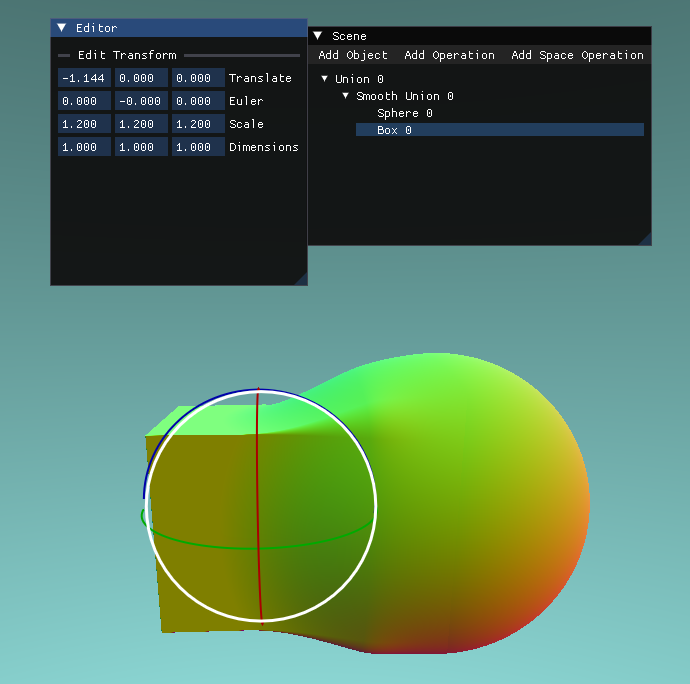
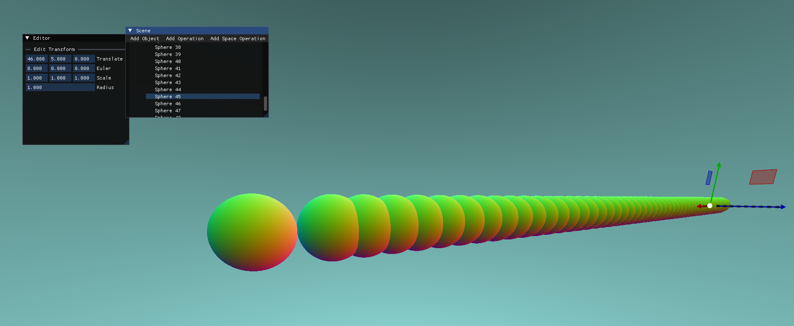
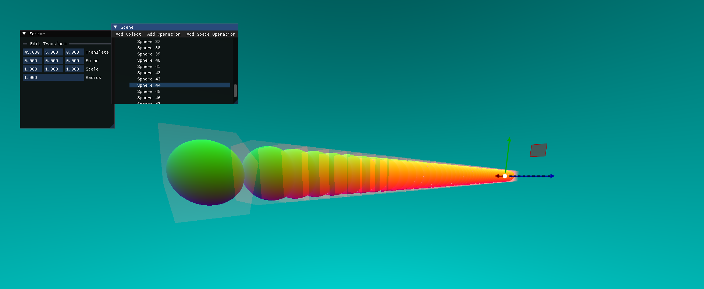

# SDF Modeling Toolkit (WIP)
---

This is a WIP SDF Modeling Toolkit made with OpenGL, C++, and OpenGL.  It renders objects using raymarching.

Right now, it supports adding and transforming different types of primitives, as well as parenting transforms (similar to Autodesk Maya).  It also supports Unions/Intersection as well as Smooth Unions/Smooth Intersection.

In order for the raymarcher to render many objects on the scene at once, I added bounding boxes: each ray that's sent out from the camera will only sample the SDFs of objects whose bounding box it intersects.  This saves a lot of time that would be lost if the ray spent a lot of time sampling many objects it could never intersect.

|  |  | 
|:--:|:--:|
| Without Bounding Boxes Visaulized | With Bounding Boxes Visualized | 

## Future Plans
I plan on...
- Improving the UI
- Allowing the user to create and customize spatial distortions like mirrors, twists, bends, repetitions...
- Image Based Lighting?
- Pathtraced Rendering?
- Allowing the export of the SDFs as OBJs
